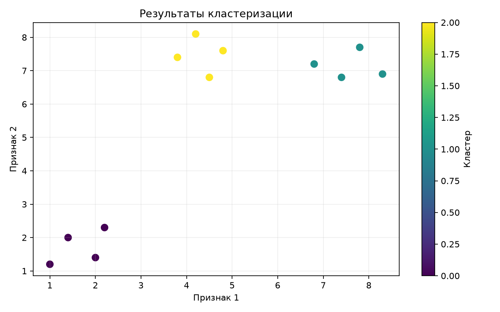
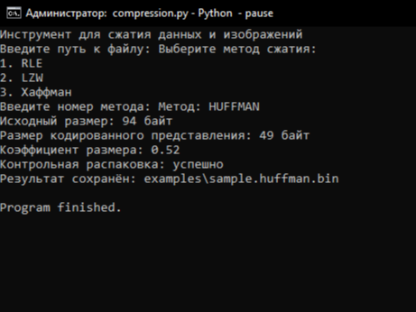

# Data Processing Algorithms

A collection of educational Python projects exploring clustering and lossless data compression algorithms.

## Clustering

`clustering.py` implements agglomerative hierarchical clustering with complete linkage. It supports Euclidean and squared Euclidean distance and visualizes the resulting clusters with Matplotlib.

## Compression

`compression.py` compares three lossless compression methods:

- Run-length encoding (RLE)
- Lempel–Ziv–Welch (LZW)
- Huffman coding

Each method performs a round-trip check to verify that the original data can be restored without changes.

## Tech stack

- Python
- NumPy
- Matplotlib
- unittest
